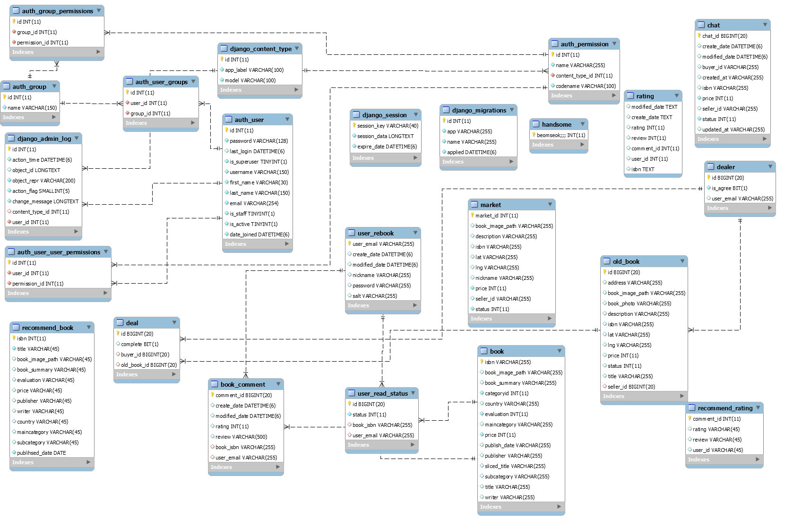

### 👨‍👨‍👧 팀원 소개

---

#### :crown: 박성준 : 팀장, 프론트엔드 , 할머니, 조연

#### 🧑 김상돈 : CDO(Chief Design Officer), 프론트엔드 , 최고령자 , PD

#### 👩 김문정 : PM(Project Manager), 프론트엔드, 집 제공, 조연

#### 🧑 서범석 : CTO(Chief Technology Officer), 백엔드, 음성남자, 배우

#### 🧑 이준혁 : 백엔드, 무야호 할아버지, 주연

#### 👩 이수민 : 서버관리자, 백엔드, 막내 온 탑, 조연

####

### 🥬 프로젝트 개요

---

### Sub-Pjt 1 (21.03.01 ~ 21.03.05)

**목표: 빅데이터 프로젝트에 대한 이해**

- 팀 프로젝트를 위한 빅데이터 기초 학습

​ 협업 툴의 전반적인 Rule 설정

​ 프로젝트 진행을 위한 개발 환경 설정

### Sub-Pjt 2 (21.03.08 ~ 21.03.19)

**목표: 주제를 선정 및 개발 시작**

- 빅데이터 활용 주제 모색 및 선정

​ 주제에 알맞은 데이터 획득 방안 탐색

​ 와이어 프레임 완성

### Sub-Pjt 3 (21.03.22 ~ 21.04.09)

**목표: 특화 프로젝트 완성**

- 사용자 기반 협업 필터링 구현

  전체적인 프로젝트 완성 및 코드 점검

  UCC 제작 및 전반적인 발표 준비

### 🤝 협업 규칙

---

##### **1 .** **1일 1 커밋 **

##### 2 . git 규칙 활용

```
master, develop 2가지 종류의 브랜치를 사용.

master : 완성된 프로젝트에 대한 브랜치

develop : 각각의 수행 작업들을 통합한 브랜치
```

- **충돌로 인해 개발 시간을 많이 잡아먹을 우려가 있어 간략한 브랜치를 구성**

- **공통 프로젝트 때 branch 만을 파서 하는 것과 차이점을 줌**

  1. Upstream Repository를 Fork한 Origin Repository의 추가

  2. Origin Repository에서 pull request를 생성 및 코드를 리뷰하여 merge 진행

  3. **이유**

     - 기존 워크 플로우를 사용한다면 Repository에 잘못 푸쉬되어 다양한 개발을 시도 못할 것이라고 판단

     - Fork한 Repository를 사용한다면 개인 Repository 내에서 원하는 만큼 코드 실험이 가능

- **GIT 환경 설정**

  ```
  프로젝트 = upstream, fork한 나의 repo = origin, 내 컴퓨터 = local
  ```

  1. 프로젝트 repo (upstream) 를 fork한다. (자기 이름/S~~ 라는 repo 생성)

  2. fork한 repo (origin) 를 clone 받는다.

     ```
     git clone 주소
     cd 해당폴더
     git remote add upstream fork한거말고 프로젝트 주소
     git remote -v (아래에 origin, upstream 둘다 있으면 맞음)
     ```

  3. 'upstream' 이라는 원격 저장소를 추가한다.

     주소는 프로젝트 repo (upstream)

     ```
     $ git remote add upstream <https://lab.ssafy.com/s04-bigdata-sub2/s04p22b206.git>
     ```

  4. web에서 upstream repo에 branch를 추가한다.

     develop 브랜치로부터 생성한다.

     혹은 terminal에서 해당 코드 실행

     ```
     $ git checkout -b 브랜치이름 --track upstream/develop
     ```

- **개발 시작**

  1. 개인별 기능 구현

  2. push

     ```
     git add .
     git commit -m "지라번호 FE - 한일" 또는
     git commit -m "지라번호 BE - 한일"
     git fetch --all
     git pull --rebase upstream develop
     ```

     error가 나온다면 충돌 발생

     git status 확인 후 unmerged가 있는 해당 파일로 가서 충돌 해결

     충돌 해결 완료 후

     ```
     git rebase --continue
     ```

     git push origin 작업브랜치

  3. GitLab

     merge할 브랜치를 프로젝트/develop으로 선택

  4. Merge하여 develop에 개인별 기능 merge 완료

  **3 . 노션 활용하기**

  **4 . 지라 활용하기**

- 지라를 통해 어제 했던 일, 오늘 할 일 반영
- 스토리 포인트 주 40시간으로 채우기 (적극적으로 활용)

  **5 . 공부한 내용이나 오류 사항 README.md로 정리**

  **6 . 공부한 내용이나 오류 사항 README.md로 정리**

  **7 . 데일리 스크럼으로 하루하루 진행사항 보고**

  **8 . 기능 완료 후 파트별로 코드 리팩토링을 통해 commit**

### ⚙️ 프로젝트 실행 메뉴얼

---

### Frontend

#### Vue.js

frontend 폴더 내 IDE 접속을 통해 필요한 패키지를 설치

```javascript
npm i  OR  npm install
```

frontend app을 실행

```javascript
npm run serve
```

### Backend

#### django

python 환경으로 django 및 필요 라이브러리 설치 / 필요 라이브러리는 requirements.txt에 저장

```python
pip install -r requirements.txt
```

장고 프로젝트 생성 및 추천 기능을 담당할 앱 생성

```python
django-admin startproject backend

python manage.py startapp recommend
```

서버 실행

```
python manage.py runserver
```

### spring

IntelliJ로 프로젝트 열기

Lombok 설치 후 적용

BookRecommendAppicataion 파일 실행

### SQL

RDS를 이용해 DB 사용

JPA로 Entitiy 생성

Django 및 Spring에서 해당 HOST 주소 연결하여 사용

MySQL workbench로 테이블 관리

### 🥬 주요 기능

---

#### 유저 기능

- 회원 가입 페이지

  ```
  이메일, 비밀번호, 닉네임으로 가입
  필수 항목이 모두 기재돼야 가입 가능
  해당 항목 내에서 특정 조건이 충족되지 않을 경우 가입 불가
  ```

- 로그인 페이지

  ```
  알맞지 않은 이메일, 패스워드 기재 시 재확인 메시지 노출
  ```

#### 카테고리

- 카테고리 선택

  ```
  중분류 선택을 통해 원하는 카테고리의 책 정보 검색(최대 3개까지 가능)
  국내도서, 외국어도서 두 분류로 검색 가능
  ```

- 전반적인 책 정보

  ```
  카테고리를 통한 책 검색 시 해당 조건에 맞는 책 이미지와 제목을 출력
  ```

- 상세 책 정보

  ```
  책 검색 시 책의 상세 정보 출력
  평점, 댓글 및 비슷한 책의 추천
  같은 책을 주변에 파는지 확인
  ```

- 책 검색

  ```
  책 검색을 통해 원하는 정보의 책 출력
  ```

#### 장터

- 판매 글 등록

  ```
  자신이 팔고자 하는 책을 위치기반으로 판매글 등록
  ```

- 책 조회

  ```
  자신이 구매하고자 하는 책을 위치기반으로 주변에서 검색
  ```

#### 내 서재

- 캘린더

  ```
  읽고 있는 책을 관리
  ```

#### 기타

- #### 채팅

  ```
  유저 간의 채팅 기능
  ```

### 💡 아이디어 기획

---

#### 책 추천 서비스(RE:BOOK)

#### 1. 기획의도

- 코로나로 인해 집에서 머무르는 시간 증가
- 독서의 중요성은 증가하지만 이예 반비례하는 독서량
- 무수히 많은 책으로 인해 책 접근이 어렵다

#### 2. 페르소나

- 독서초보

  - 무슨 책을 읽어야 할지 모르겠다
  - 책이 너무 비싸다
  - 중고서점이 있지만 집에서 멀고, 거기까지 갈 열정은 없다.

- 독서 중수

  - 책을 좋아해서 샀지만, 결국 나에게 맞지 않아서 책장을 장식하는 빈도가 많다.

  - 쌓인 책들이 아까운데 팔고 다시 사는 프로세스가 귀찮다

#### 3. 서비스

- RECOMMEND: 협업 필터링을 통한 사용자에게 어울리는 책 추천
- RESELL: 중고장터를 통한 저렴한 가격으로 책 구매, 판매
- RECORD: 기록을 통해 독서 스케줄 관리

### 📗와이어프레임

---

- 회원가입


- 로그인


- 책검색


- 메인페이지


- 내 서재

  

- 도서관 위치

- 마이페이지

  

- 장터

  

- 채팅

  

### 🥬 DB Schema

---

### 
