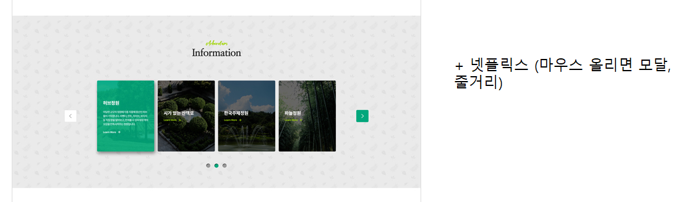
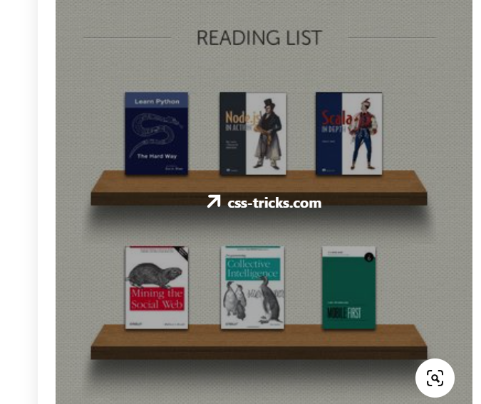
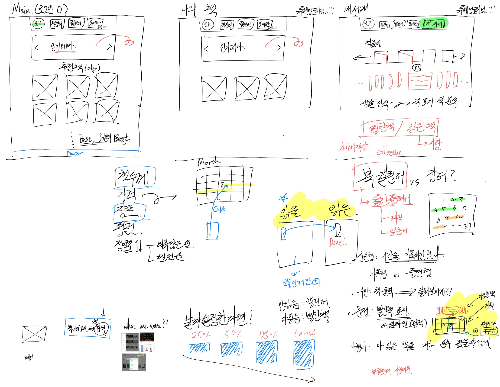
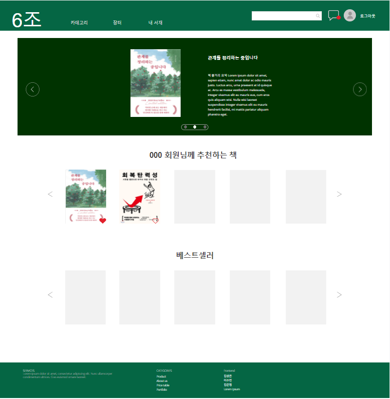
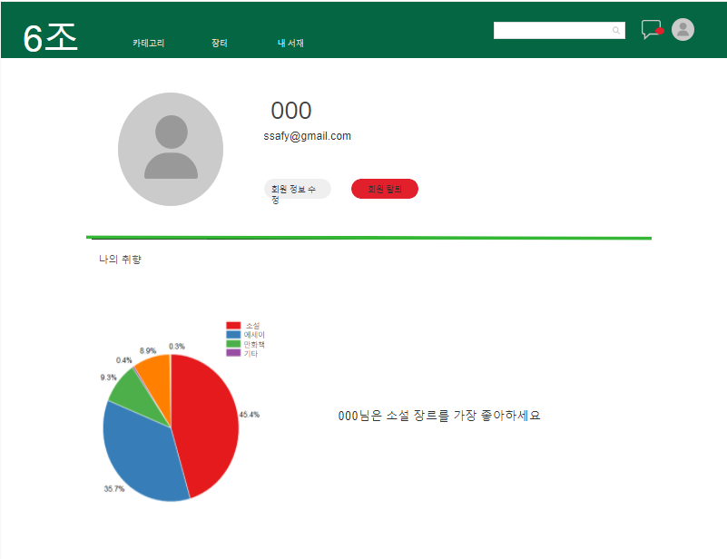
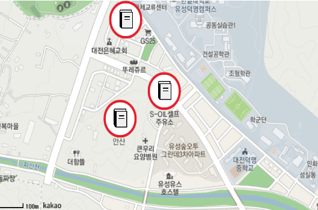
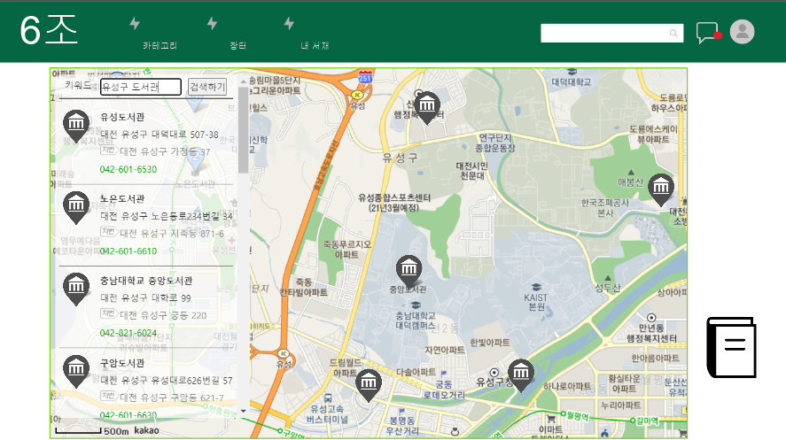

# 목차

[디자인](#디자인)

- [1. 메인- 책 표지 및 줄거리](##1.-메인---책-표지-및-줄거리)
- [2. 내 서재 - 책 선반](##2.-내-서재---책선반)

[와이어 프레임](#와이어-프레임)

- [메인](##메인)
- [마이페이지](##마이페이지)
- [장터(확정아님)](##장터(확정아님))
- [도서관(확정아님)](##도서관(확정아님))

 

# 디자인

## 1. 메인 - 책 표지 및 줄거리

## 2. 내 서재 - 책선반

# 와이어 프레임

## 메인

## 마이페이지

## 장터(확정아님)

## 도서관(확정아님)

# Git 

중앙 집중식 -> 분산형

## 상세페이지 수정할 것

- 도서관 도서 보유 유무  --V
- 버튼 추가 및 수정 => 읽고 싶어요 / 읽고 있어요 / 읽었어요  --V
- 장터 페이지 자연스럽게 연결될 수 있도록 구성  --V
- 중간에 도서 상세 정보 추가    --V
- 

## 나의 책장

- 읽고 싶어요 / 읽고 있어요 / 읽었어요 반영을 위해 책장 추가 및 수정  --V

## 메인페이지 

- 로그인 안 했을 때 화면( 간략한 사이트 소개 + 시작하기 버튼 )

## 책 검색

- 필터링이 아닌 키워드 검색으로 변경, 평점은 현행 유지

## +@ 

- 팀 소개

