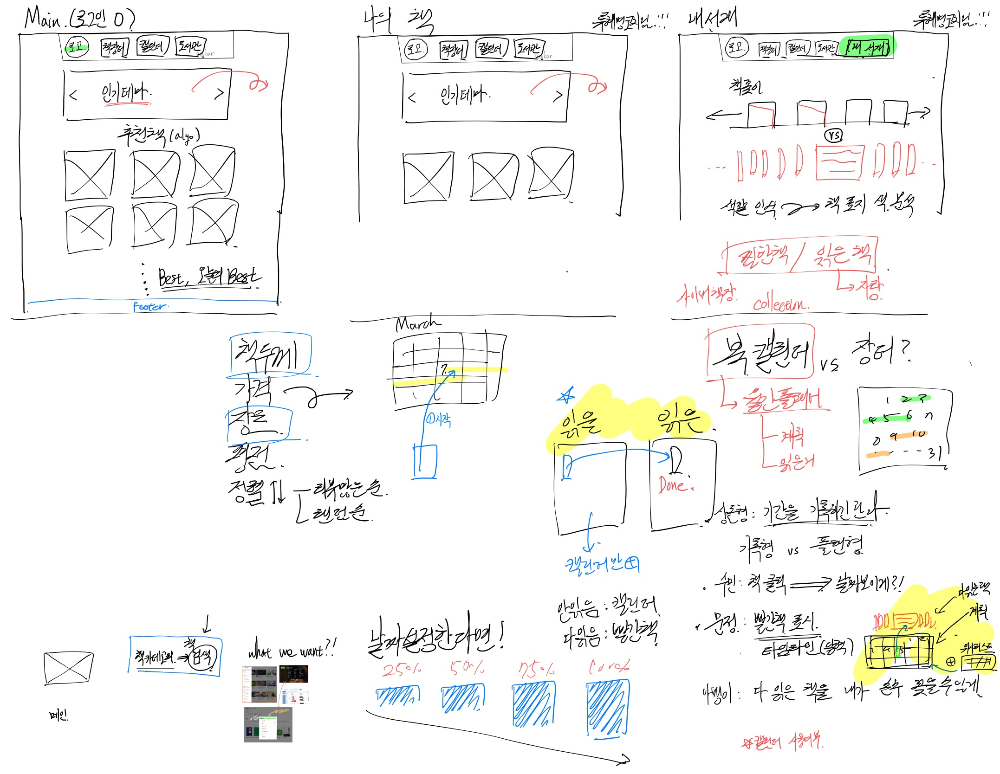
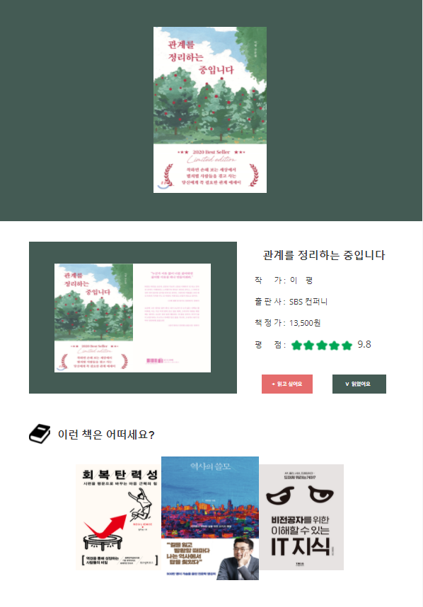
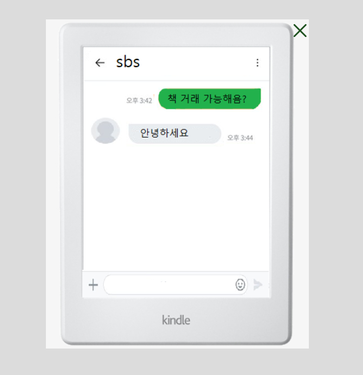

**와이어프레임 참고 홈페이지**

- 잡지 메인

https://magazine-b.co.kr/

https://bricksmagazine.co.kr/

https://form.de/
 
 

- 채팅 거래

https://happist.com/561440/%eb%8f%85%ec%9d%bc-%ec%a0%84%ec%9e%90%ec%b1%85-%eb%b8%8c%eb%9e%9c%eb%93%9c-%ed%86%a8%eb%a6%ac%eb%85%b8tolino%ec%9d%98-%ec%95%84%eb%a7%88%ec%a1%b4-%ea%b7%b9%eb%b3%b5-%eb%b0%a9%eb%b2%95

https://www.daangn.com/

- 웹페이지 수장작 참고

http://gdweb.co.kr/sub/list.asp?RetrieveFlag=&Page=1&str_String=%3Fdisplayrow%3D60%26Txt_key%3Dall%26Txt_word%3D%26Txt_agnumber%3D%26Txt_fgbn%3D5%26Txt_bcode1%3D%26Txt_gbflag%3D%26Txt_bcode2%3D%26Txt_bcode3%3D%26Txt_bcode4%3D%26Txt_bcode5%3D%26Page%3D&Txt_word=&Txt_fgbn=5&Txt_bcode1=022110001&Txt_gbflag=&Txt_bcode2=&Txt_bcode3=&Txt_bcode4=&Txt_bcode5=&Txt_agnumber=&str_no=

- 블록마을처럼

https://kr.123rf.com/visual/search/58800642

**와이어프레임 구성**

와이어프레임 (목업툴로 작업 ) 

- 사용된 목업 : Justinmind

- book 상세 페이지

  

- 채팅 화면

  모달창으로 구현할 예정

  