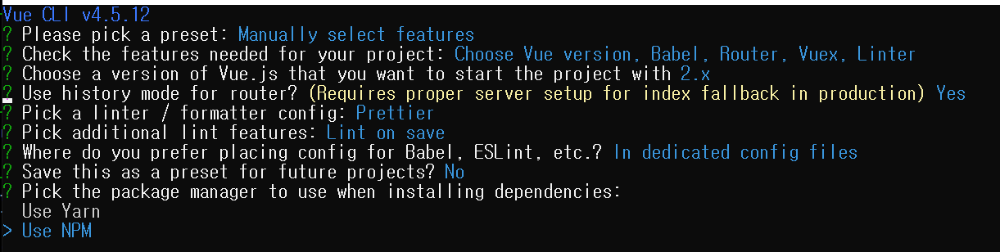
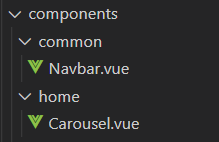
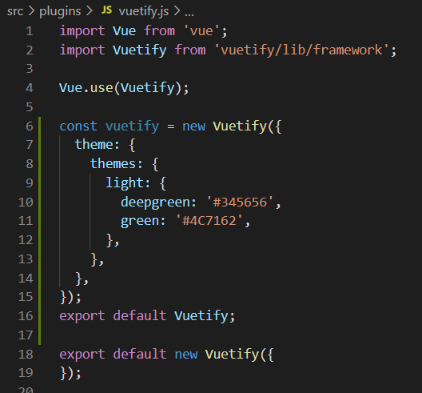

# 목차

[구성](#구성)

[Convention](#Convention)

- [파일 작성 위치](##파일-작성-위치)
- [파일명](##파일명)

[Vuetify custom](#Vuetify-custom)

- [색상(에러)](##색상)

---------------

# 구성

| Package    | Version |                                    |
| ---------- | ------- | ---------------------------------- |
| @vue/cli   | 4.5.12  |                                    |
| Vue.js     | 2.x     | vuetify 사용을 위해 version.2 사용 |
| vue-router | 3.2.0   | 브라우저에서 화면 전환을 위해 사용 |
| vuex       | 3.6.2   | 상태 관리 패턴 + 라이브러리        |
| vuetify    | 2.4.0   | UI 구성                            |

# Convention

## 파일 작성 위치

- page는 views

- page의 일부는 components

- components 내부에서 해당 페이지 별로 폴더 만들어서 사용

  (다른 페이지에도 쓰일 부분은 common 폴더에 작성)

  

## 파일명

- vue 파일의 파일명은 대문자로 시작

# Vuetify custom

## 색상(ㅇㅔ러)

> navbar 페이지에서 custom한 색상 사용시, 검은색으로만 표현된다.

- 

