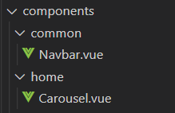
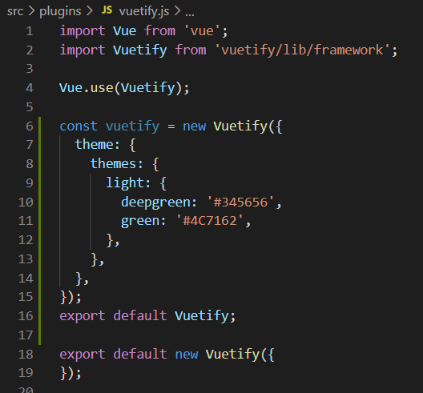

# 목차

[Convention](#Convention)

- [파일 작성 위치](##파일-작성-위치)

- [파일명](##파일명)

# Convention

## 파일 작성 위치

- page는 views

- page의 일부는 components

- components 내부에서 해당 페이지 별로 폴더 만들어서 사용

  (다른 페이지에도 쓰일 부분은 common 폴더에 작성)

  

## 파일명

- vue 파일의 파일명은 대문자로 시작

# Vuetify custom

## 색상

- 

